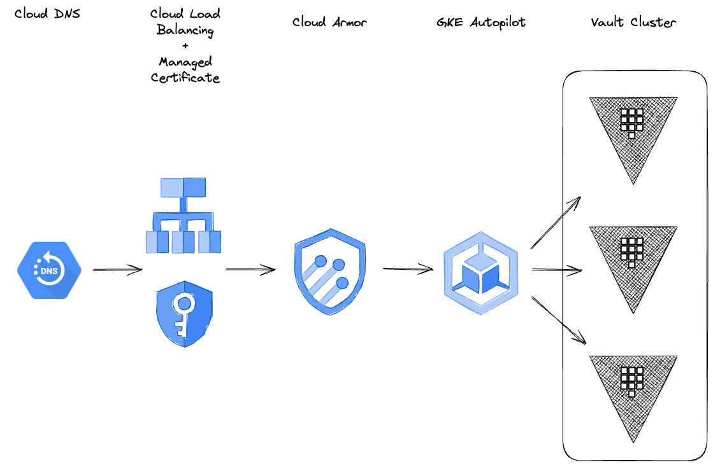

# terraform-gcp-vault-gke
This repository contains an example terraform deployment for a HashiCorp Vault cluster on GKE Autopilot.



## Pre-requisites
- A sandbox Google Cloud project with owner IAM permissions
- A Google Cloud DNS managed zone with delegation to the sandbox project

## Architecture
The following resources are created:
- GKE Autopilot cluster
- Cloud Armor security policy 
- Cloud DNS record
- Cloud Load Balancer
- Cloud NAT
- Cloud Network
- Vault helm chart

## Setup
The following tools are required to run this example:
- curl
- git
- Google Cloud SDK + gke-gcloud-auth-plugin
- helm
- jq
- kubectl
- Makefile
- Terraform

Google Cloudshell has the necessary tools installed to run this example and can be accessed by the URL below.
https://shell.cloud.google.com/?show=terminal

Open the Google Cloudshell terminal and set the project if not already set:
```bash
gcloud config set project _project_id_
gcloud auth list
```

Clone the repo and change to the folder:
```bash

git clone https://github.com/nhsy-hcp/terraform-gcp-vault-gke.git
cd terraform-gcp-vault-gke
```
Create a file named `terraform.tfvars` with the following variables and set values accordingly:
```hcl
project = "my-vault-project"
region  = "europe-west1"
dns_managed_zone_name = "my-dns-zone"
vault_fqdn = "vault.example.com"
```

## Deployment
Add the Hashicorp helm repository verify it is working:
```bash
make helm-setup
````

Deploy the GKE Autopilot cluster and HashiCorp Vault helm chart:
```bash
make init
make gke
make vault-install
```
The output of the above command should be similar to the below:
```bash
Outputs:

gke_cluster_name = "vault-autopilot-knupw"
project = "vault-autopilot"
region = "europe-west1"
vault_fqdn = "vault.example.com"
vault_ip_address = "x.x.x.x"
vault_url = "https://vault.example.com"

Fetching cluster endpoint and auth data.
kubeconfig entry generated for gke-autopilot-knupw.
Kubernetes control plane is running at https://x.x.x.x
GLBCDefaultBackend is running at https://x.x.x.x/api/v1/namespaces/kube-system/services/default-http-backend:http/proxy
KubeDNS is running at https://x.x.x.x/api/v1/namespaces/kube-system/services/kube-dns:dns/proxy
Metrics-server is running at https://x.x.x.x/api/v1/namespaces/kube-system/services/https:metrics-server:/proxy

To further debug and diagnose cluster problems, use 'kubectl cluster-info dump'.
```

## Initialize HashiCorp Vault Cluster
Automatically initialize the Hashicorp Vault cluster:
```bash
make vault-init
```
The output of the above command should be similar to the below:
```bash
pod/vault-0 condition met
pod/vault-1 condition met
pod/vault-2 condition met
...
...
...
{"initialized":true,"sealed":false,"standby":false,"performance_standby":false,"replication_performance_mode":"disabled","replication_dr_mode":"disabled","server_time_utc":1702926169,"version":"1.15.4","cluster_name":"vault-cluster-1d3bdd59","cluster_id":"8fa6f6cf-e9f8-0ee6-4d03-b6d0a051f6b2"}
* Connection #0 to host vault.example.com left intact

Node       Address                        State       Voter
----       -------                        -----       -----
vault-0    vault-0.vault-internal:8201    leader      true
vault-1    vault-1.vault-internal:8201    follower    true
vault-2    vault-2.vault-internal:8201    follower    false

VAULT_ADDR: https://vault.example.com
VAULT_TOKEN: xxxxxxxx-xxxx-xxxx-xxxx-xxxxxxxxxxxx
```

## Monitor 
Once HashiCorp Vault has been deployed and initialized it can take upto 20 minutes for the Google Managed Certificate to be validated and propagated.

In another terminal, watch the HashiCorp Vault namespace events:
```bash
make vault-events
```
In another terminal, watch the HashiCorp Vault pod logs:
```bash
make vault-logs
```
In another terminal, curl the HashiCorp Vault URL:
```bash
make vault-curl
```
Upon successful deployment the output of the `make vault-curl` command will be similar to the following:
```bash
< HTTP/2 200 
< cache-control: no-store
< content-type: application/json
< strict-transport-security: max-age=31536000; includeSubDomains
< date: Thu, 21 Dec 2023 15:53:54 GMT
< content-length: 295
< via: 1.1 google
< alt-svc: h3=":443"; ma=2592000,h3-29=":443"; ma=2592000
< 
{"initialized":true,"sealed":false,"standby":false,"performance_standby":false,"replication_performance_mode":"disabled","replication_dr_mode":"disabled","server_time_utc":1703174034,"version":"1.15.4","cluster_name":"vault-cluster-60faa0bd","cluster_id":"1192efbe-f8d0-0c09-8663-26d2d363c896"}
* Connection #0 to host vault.example.com left intact

```
## Cleanup
Destroy the Hashicorp Vault and GKE autopilot cluster deployment:
```bash
make destroy
```

## Vault Enterprise Edition
You can deploy Vault Enterprise Edition by settings the following values in `terraform.tfvars`:
```hcl
vault_license     = "_LICENSE-STRING_"
vault_repository  = "hashicorp/vault-enterprise"
vault_version_tag = "1.15.4-ent"
```
